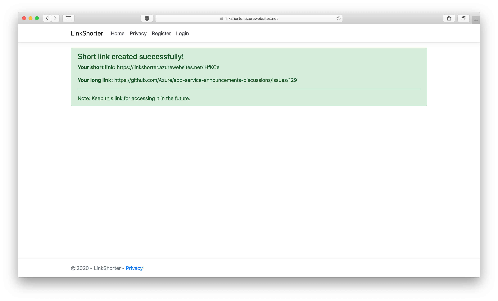

# Link shorter
> Sample web application to make your links shorter!

## Table of contents
* [General info](#general-info)
* [Screenshorts](#screenshots)
* [Technologies](#technologies)
* [Setup](#setup)
* [Features](#features)
* [Status](#status)
* [Inspiration](#inspiration)
* [Contact](#contact)

## General info
This is my first project written with .NET Core. It was developed to do some training with MVC model, Entity Framework and Bootstrap. I know there is a lot to do and some things are not good but I will try to develop this project in future.

## Screenshots





## Technologies
* .NET Core - version 2.2
* Entity Framework Core - version 2.2
* Bootstrap - version 4.3.1 

## Setup

1. Make sure you have installed and it's up and running [Docker](https://www.docker.com)
2. Make sure you have installed [.NET Core SDK](https://dotnet.microsoft.com/download)
3. Open terminal and clone this repo as below: 

```bash
git clone https://github.com/tomaszkyc/link-shorter.git
cd link-shorter
```
4. Here run command which will create a container with a database: 
```bash
docker-compose up
```
5. In another terminal tab / window go to location <path-to-relink-shorter-repo>/LinkShorter/LinkShorter as below:
```bash
cd LinkShorter/LinkShorter
```
6. Run application with command below:
```bash
dotnet run
```
7. At the end of command you should see output like below: 
```bash
Hosting environment: Development
Content root path: /Users/tomasz/git/link-shorter/LinkShorter/LinkShorter
Now listening on: https://localhost:5001
Now listening on: http://localhost:5000
Application started. Press Ctrl+C to shut down.
```
8. Go to one of given web address and you should see main page:


9. To login as Admin use credentials from __Admin section__ inside config file:
```bash
LinkShorter/LinkShorter/appsettings.json
```

## Features
List of features ready and TODOs for future development
* Create short links in just a seconds
* Save long links and view statistics about use per day, web browser and platform
* Manage users by simple admin panel with 3 roles:
- User - can create random short links, see statistics about usege
- PowerUser - can create random and custom short links, see statistics about usege
- Admin - can manage users in app, create random and custom short links, see statistics about usege

To-do list:
* Add logging to application
* Add new statistics and CSV-download statistics
* Reorganize controllers paths
* Add unit testing


## Status
Project is _no longer continue_ because of no more time and need to learn other things connected with .NET Core and Entity Framework Core.

## Inspiration
The idea of making links shorter is old. My inspiration was [https://bitly.com](https://bitly.com) which has outstanging market share.

## Contact
Created by [@tomaszkyc](https://tomaszkyc.github.io) - feel free to contact me!